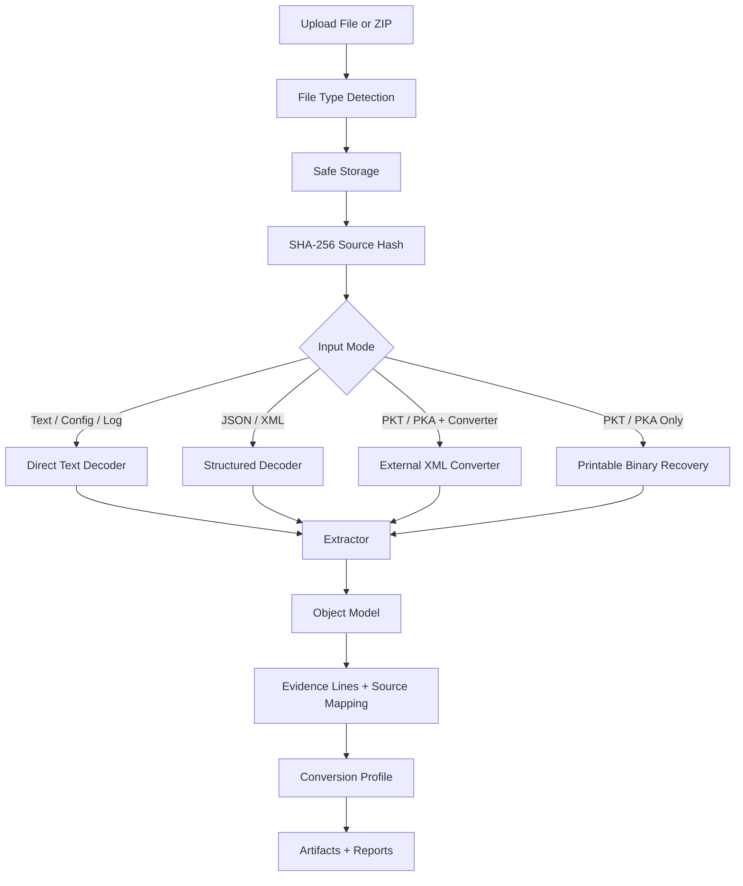
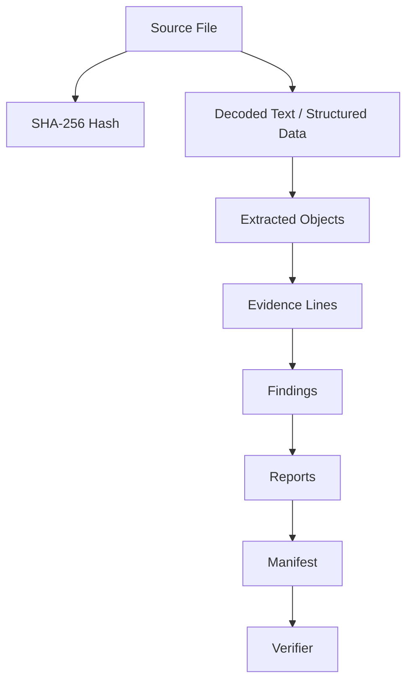
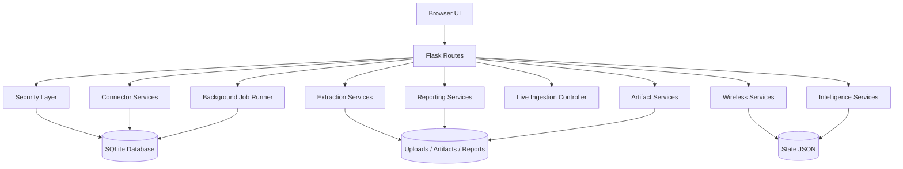

<div align="center">

# 🛡️ WiGuard Nexus

### Packet Tracer Evidence Intelligence • Wireless Policy Manager • Runtime Risk & Report Builder

WiGuard Nexus is a Flask-based network evidence workspace that converts Packet Tracer labs, Cisco configuration exports, wireless events, and connector payloads into a verified, searchable, report-ready security and network assurance platform.

It is designed for cybersecurity students, network engineers, wireless teams, auditors, and blue-team analysts who need to move from raw network evidence to clear findings, topology understanding, policy validation, and professional reports.

[](#quick-start)
[](#technology-stack)
[](#storage--database-model)
[](#packet-tracer-conversion-engine)
[](#report-builder)

**Current package version:** `5.8.0-deep-cleanup-ui-policy-runtime`  
**Validation status from packaged test results:** `compileall: PASS` • `pytest: 30 passed`

</div>

---

## Table of Contents

- [What WiGuard Nexus Does](#what-wiguard-nexus-does)
- [Why This Project Matters](#why-this-project-matters)
- [Core Workflow](#core-workflow)
- [Main Capabilities](#main-capabilities)
- [Packet Tracer Conversion Engine](#packet-tracer-conversion-engine)
- [Runtime Evidence Intelligence](#runtime-evidence-intelligence)
- [Wireless Policy Manager](#wireless-policy-manager)
- [Policy Studio](#policy-studio)
- [Topology, Diff, Root Cause, and Simulation](#topology-diff-root-cause-and-simulation)
- [Report Builder](#report-builder)
- [Evidence Integrity and Verification](#evidence-integrity-and-verification)
- [Security Model](#security-model)
- [Live Ingestion and Connector Layer](#live-ingestion-and-connector-layer)
- [Architecture](#architecture)
- [Quick Start](#quick-start)
- [Production-Like Configuration](#production-like-configuration)
- [Packet Tracer Accuracy Workflow](#packet-tracer-accuracy-workflow)
- [API Usage](#api-usage)
- [Testing](#testing)
- [Project Structure](#project-structure)
- [Demo Scenario](#demo-scenario)
- [Roadmap](#roadmap)
- [Known Limitations](#known-limitations)
- [License, Privacy, and Security](#license-privacy-and-security)

---

## What WiGuard Nexus Does

WiGuard Nexus turns scattered network evidence into an analyst-friendly workspace.

Instead of manually reading multiple Packet Tracer exports, Cisco configuration files, command outputs, wireless event logs, and screenshots, WiGuard builds a structured model that can be inspected, validated, compared, and exported as professional reports.

At a high level, WiGuard answers questions like:

| Question | WiGuard Capability |
|---|---|
| What devices, VLANs, interfaces, ACLs, routes, APs, SSIDs, and clients exist? | Object extraction and inventory mapping |
| Is the Packet Tracer import complete enough to trust? | Conversion readiness score and quality gates |
| Which evidence lines prove every finding? | Line-level evidence mapping and artifact manifests |
| Are VLANs consistently configured across access ports, SVIs, DHCP gateways, and trunks? | VLAN crosscheck and relationship analysis |
| Are ACLs actually receiving runtime hits? | Runtime ACL counter parsing |
| Are interfaces unhealthy or error-heavy? | Interface counter extraction and runtime risk atoms |
| Are wireless clients mapped to the right SSID, AP, VLAN, DHCP policy, and role? | Wireless policy manager and validation matrix |
| What changed between expected design and actual extracted reality? | Policy Diff and Snapshot Diff |
| What is the likely root cause and what should be verified next? | Root Cause Analyzer and remediation playbooks |
| Can the evidence package be trusted later? | Manifest verification and audit hash chain |
| Can this be turned into executive and technical reports? | Report Builder with JSON, HTML, PDF, and Evidence ZIP |

---

## Why This Project Matters

Packet Tracer and small-to-medium network labs are usually evaluated manually. That creates a few common problems:

- Evidence is scattered across `.pkt`, `.pka`, `.cfg`, `.txt`, `.log`, `.json`, `.xml`, and ZIP bundles.
- Native Packet Tracer files are proprietary, so blindly claiming perfect parsing is misleading.
- Network findings often lack proof, line references, confidence scoring, or command coverage.
- Wireless events and policy decisions are hard to correlate with topology and VLAN evidence.
- Reports are usually written manually and can miss source hashes, appendices, or audit context.

WiGuard Nexus is built around one principle:

> **Be powerful, but evidence-honest.**

That means WiGuard extracts as much as possible, scores the quality of the evidence, explains what is missing, and marks lower-confidence native Packet Tracer recovery differently from direct exported configs or command outputs.

---

## Core Workflow

```text
Tenant
  → Project
    → Upload evidence
      → Decode / Convert
        → Extract objects
          → Map relationships
            → Score readiness
              → Validate policy
                → Analyze risk
                  → Generate reports
                    → Verify evidence package
```

GitHub renders the workflow below as a Mermaid diagram:

```mermaid
flowchart LR
    A[Tenant] --> B[Project]
    B --> C[Upload Packet Tracer / Config / Logs / ZIP]
    C --> D[Safe Intake + SHA-256 Hash]
    D --> E[Packet Tracer Conversion Engine]
    E --> F[Object + Evidence Extraction]
    F --> G[Relationship Mapping]
    G --> H[Policy Diff + Runtime Risk]
    H --> I[Topology + Root Cause]
    I --> J[Report Builder]
    J --> K[Evidence ZIP + Manifest Verification]
```



---

## Main Capabilities

### 1. Packet Tracer and Cisco Evidence Conversion

- Native `.pkt` and `.pka` intake with safe file storage.
- Optional external XML converter support through `PTEXPLORER_PATH`.
- Printable binary recovery fallback for native Packet Tracer files when no converter is configured.
- Direct parsing for `.cfg`, `.conf`, `.txt`, `.log`, `.xml`, `.json`, and ZIP evidence bundles.
- SHA-256 source hashing for traceability.
- Conversion profile with readiness scoring, missing command checklist, quality gates, and coverage domains.

### 2. Deep Network Object Extraction

WiGuard extracts and normalizes evidence such as:

- Devices and hostnames.
- Interfaces, routed ports, access ports, trunks, SVIs, dot1q subinterfaces, and normalized interface names.
- VLAN definitions from configuration and `show vlan brief` output.
- DHCP pools, default routers, VLAN-to-gateway matching, and address ranges.
- ACL rules, ACL bindings, and runtime hit counters.
- Static routes, protocol hints, route table rows, OSPF neighbors, and protocol summaries.
- CDP and LLDP topology links.
- Spanning Tree state, root bridge evidence, root ports, and forwarding/blocking signals.
- EtherChannel summaries and uplink health.
- MAC address tables and ARP tables.
- Device facts from inventory and show-version style evidence.
- Management-plane hardening signals such as AAA, SSH, Telnet, SNMP, HTTP, NTP, logging, and enable secret/password usage.
- Wireless hints including SSID, WLAN, RADIUS, and AP clues.

### 3. Runtime Risk Intelligence

Version `5.8.0` adds stronger runtime-aware analysis:

- `show vlan brief` parsing with VLAN-to-port mapping.
- `show access-lists` runtime match counters.
- `show interfaces` counters for input errors, output errors, CRC, drops, and link health.
- STP root bridge/root-port evidence.
- Protocol summary signals for OSPF, EIGRP, RIP, BGP, NAT, DHCP, and HSRP.
- VLAN crosscheck across configured VLANs, operational VLANs, DHCP gateway evidence, access/SVI evidence, and trunks.
- Runtime risk atoms for weak management plane, interface errors, missing trunk VLANs, and zero-hit ACLs.

### 4. Wireless Policy Manager

The wireless layer helps validate Wi-Fi design and client behavior:

- SSID inventory.
- AP inventory.
- Client inventory.
- Client sessions and event timeline.
- Role changes.
- DHCP/VLAN/AP trunk validation matrix.
- Wireless risk scoring.
- Anomaly detection for authentication failures, roaming, policy violations, and suspicious event patterns.
- CSV/JSON wireless event imports.

### 5. Product and Enterprise Features

WiGuard is not just a parser. The current package includes a broader product layer:

- Tenant-aware projects, imports, events, and snapshots.
- Role-based UI and protected routes.
- SQLite database with migrations.
- API token creation with scopes.
- Audit log with tamper-evident hash-chain verification.
- Background job queue with start/stop, run-next, retry, attempts, progress, and status tracking.
- Live ingestion settings and UDP syslog listener controller.
- Connector status, connector import, sync preview, and connector run history.
- Database backup list and health checks.
- Production-oriented auth controls such as invites, reset tokens, session registry, forced logout, and user enable/disable.

---

## Packet Tracer Conversion Engine

WiGuard is built to handle real-world Packet Tracer limitations honestly.

Native Packet Tracer files are proprietary. A project that claims perfect native `.pkt` parsing without a converter is usually overclaiming. WiGuard avoids that by separating evidence quality into modes.

| Input Type | Accuracy Level | Notes |
|---|---:|---|
| ZIP containing exported configs and show outputs | Highest | Recommended workflow for final reports |
| `.cfg`, `.conf`, `.txt`, `.log` | High | Direct parsing with line-level evidence |
| `.json` | High/Medium | Uses structured object model when available |
| `.xml` | Medium/High | Supports external converter output |
| `.pkt` / `.pka` with `PTEXPLORER_PATH` | Medium/High | Uses external XML conversion helper |
| `.pkt` / `.pka` without converter | Partial | Printable binary recovery only; clearly marked lower confidence |

### Conversion Pipeline



### Conversion Quality Gates

WiGuard generates a conversion profile that checks whether the import contains enough evidence for serious analysis.

| Gate | Purpose |
|---|---|
| Device identity | Confirms hostnames, device facts, and inventory signals |
| Interface coverage | Confirms interface names, modes, status, and IP/VLAN assignments |
| VLAN coverage | Confirms VLAN definitions, access ports, trunks, and operational VLAN hints |
| Security policy coverage | Confirms ACLs, ACL bindings, hardening, and runtime hit counters |
| Topology evidence | Confirms CDP/LLDP links and path intelligence |
| Routing coverage | Confirms static/dynamic routing and protocol state |
| Wireless coverage | Confirms SSID/AP/client/event evidence |
| Operations coverage | Confirms counters, runtime health, and operational state |
| Line-level traceability | Confirms findings can be tied back to source evidence |
| Native Packet Tracer confidence | Penalizes unsupported binary-only recovery when evidence is incomplete |

### Recommended Evidence Bundle

For the best results, export these from every relevant device and upload them as one ZIP:

```text
show running-config
show vlan brief
show interfaces trunk
show ip interface brief
show access-lists
show cdp neighbors detail
show lldp neighbors detail
show spanning-tree
show spanning-tree root
show port-security interface
show etherchannel summary
show interfaces status
show interfaces counters/errors
show ip route
show ip ospf neighbor
show inventory
show version
show mac address-table
show arp
```

---

## Runtime Evidence Intelligence

WiGuard does not stop at static config parsing. It also tries to understand operational evidence.

### Runtime Signals

| Signal | Example Value | Analyst Use |
|---|---|---|
| ACL hit counters | `permit tcp any any matches 142` | Detect unused or zero-hit rules |
| Interface counters | CRC, drops, input/output errors | Identify physical layer or link health issues |
| STP root evidence | Root bridge and root port | Validate L2 design and loop prevention |
| Protocol summary | OSPF/EIGRP/BGP/NAT/DHCP/HSRP hints | Confirm control-plane behavior |
| Operational trunk state | Allowed, active, forwarding VLANs | Detect VLAN mismatch or missing trunk allowance |
| VLAN crosscheck | Config vs runtime vs DHCP vs access/SVI evidence | Detect inconsistent segmentation design |

### Runtime Risk Atoms

Runtime risk atoms are small, explainable findings that can be used by the UI, reports, policy rules, and remediation playbooks.

Examples:

- Management plane exposes weak services.
- Trunk missing VLANs that appear elsewhere in the environment.
- Interface has high error counters or drops.
- ACL exists but has zero runtime matches.
- VLAN appears in DHCP or SVI evidence but is missing from trunk forwarding evidence.
- STP evidence is missing for a switch-heavy topology.

---

## Wireless Policy Manager

The wireless manager is built to correlate Wi-Fi state with network policy.

### Wireless Objects

| Object | Description |
|---|---|
| SSID | Wireless network profile, expected VLAN, security, and role mapping |
| AP | Access point inventory, site, uplink, and trunk assumptions |
| Client | MAC/user/device identity and role |
| Session | Client association to SSID/AP/VLAN/DHCP result |
| Event | Authentication failure, roam, role change, DHCP update, connector import, anomaly, or policy violation |
| Policy Rule | Expected behavior and validation logic |

### Wireless Validation Matrix

The wireless page evaluates whether the observed session is consistent with policy:

```text
Client → SSID → AP → VLAN → DHCP → AP Trunk → Policy Result
```

This helps answer:

- Is the client connected to the expected SSID?
- Is the SSID mapped to the correct VLAN?
- Does DHCP evidence match the VLAN gateway?
- Does the AP uplink/trunk allow the needed VLAN?
- Did the user role change as expected?
- Are there anomalies that should be investigated?

---

## Policy Studio

Policy Studio turns raw evidence into rules, controls, and analyst-facing checks.

### Policy Rule Capabilities

- Rule name and category.
- Scope and condition fields.
- Severity score.
- Control mapping.
- Action type.
- Remediation text.
- Evidence-required fields.
- False-positive guards.
- Acceptance criteria.
- Rule versioning.
- Current evidence testing table.

### Example Policy Ideas

| Policy | Evidence Required | Impact |
|---|---|---|
| ACL must have runtime hits | `show access-lists` counters | Detect dead segmentation controls |
| Trunk must carry required VLANs | trunk config + operational trunk output | Detect client connectivity and segmentation breakage |
| Management plane must avoid Telnet/HTTP | running-config hardening lines | Reduce credential exposure risk |
| Interface error health must be acceptable | interface counters/errors | Detect physical layer instability |
| Wireless client role must match SSID/VLAN policy | client session + AP + VLAN + DHCP | Detect policy drift and access mistakes |
| Evidence completeness must be high before final report | command checklist + quality gates | Prevent false confidence in weak evidence |

---

## Topology, Diff, Root Cause, and Simulation

### Topology Intelligence

The topology page maps extracted devices and links using evidence such as:

- CDP neighbors.
- LLDP neighbors.
- Interface references.
- Trunk relationships.
- VLAN paths.
- Device identity signals.
- Confidence and evidence metadata.

### Policy Diff

Policy Diff compares expected design assumptions against extracted reality.

It helps highlight:

- Missing VLANs.
- Wrong access VLAN assignments.
- Trunk gaps.
- ACL mismatches.
- Wireless role mismatches.
- Missing operational evidence.
- Weak or incomplete management-plane hardening.

### Root Cause Analyzer

Root Cause Analyzer groups findings into likely causes and suggests next verification steps.

Examples:

| Finding | Possible Root Cause | Verification Command |
|---|---|---|
| Client cannot reach expected subnet | Missing VLAN on AP trunk | `show interfaces trunk` |
| ACL not enforcing expected segmentation | ACL not applied or zero-hit rule | `show access-lists` + `show running-config interface` |
| VLAN exists in DHCP but not on switch | Incomplete VLAN creation or trunk allowance | `show vlan brief` + `show interfaces trunk` |
| Intermittent link behavior | CRC/input errors | `show interfaces counters errors` |
| L2 path instability | STP root/port mismatch | `show spanning-tree root` |

### Simulation Engine

The simulation page supports access simulation and what-if style checks based on the currently extracted model.

---

## Report Builder

WiGuard includes a multi-template report builder for different audiences.

| Report Type | Audience | Purpose |
|---|---|---|
| Executive Report | Managers, instructors, decision makers | High-level risk, business impact, top concerns |
| Technical Network Report | Network engineers | Deep evidence, topology, policy diff, object inventory |
| Compliance Matrix Report | Auditors | Control status, risk ownership, evidence mapping |
| Packet Tracer Conversion Report | Lab reviewers | Readiness score, command checklist, missing evidence |
| Wireless Risk Report | Wireless engineers | AP/SSID/client risk, anomalies, validation matrix |
| Security Escalation Report | Security team | Critical findings, root cause, remediation playbooks |
| Audit Evidence & Appendix Report | Auditors / reviewers | Manifest, source hashes, line evidence, verifier notes |
| Evidence Appendix | Technical appendix | Raw evidence references and integrity notes |
| Wireless Event & Policy Report | Wireless operations | Events, sessions, roles, AP/SSID policy checks |
| Full Evidence Report | Complete submission | Combined executive, technical, policy, topology, wireless, and appendix view |

### Export Formats

WiGuard can generate:

- JSON reports.
- HTML reports.
- PDF reports through ReportLab.
- Evidence ZIP packages.
- Artifact manifests.
- Custom report previews.

---

## Evidence Integrity and Verification

WiGuard is designed around traceability.

### Evidence Integrity Features

- SHA-256 hash of uploaded source evidence.
- Stored source filename and import metadata.
- Artifact manifest generation.
- Evidence ZIP generation.
- Manifest verification page.
- Audit log entries for imports, artifact generation, connector actions, auth events, and admin operations.
- Tamper-evident audit hash chain.
- CSV audit export.

### Evidence Model



---

## Security Model

WiGuard includes several security controls intended for safer local demos and production-like deployments.

### Authentication and Authorization

- Login page.
- Registration page.
- Development fallback admin account can be disabled.
- Password hashing through Werkzeug.
- Password policy enforcement.
- Role-based access control.
- Invite tokens.
- Password reset tokens.
- Session registry.
- Forced logout support.
- API tokens with scopes.

### Roles

| Role | Typical Access |
|---|---|
| Anonymous | Login/register only |
| Analyst | Import evidence, simulate, view analyst workspace |
| Engineer | Modify wireless/AP/SSID/client/policy configuration |
| Auditor | View APIs, reports, evidence, verifier, and audit-oriented pages |
| Admin | Settings, users, tokens, backups, live ingestion, jobs, system actions |

### Request and Browser Hardening

- CSRF token validation for unsafe methods.
- Login rate limiting.
- Safe redirect handling.
- Secure cookie flags.
- HTTP-only session cookie.
- SameSite cookie mode.
- Optional secure cookie enforcement in production.
- Security headers:
  - `X-Content-Type-Options: nosniff`
  - `X-Frame-Options: DENY`
  - `Referrer-Policy: strict-origin-when-cross-origin`
  - `Permissions-Policy`
  - `Content-Security-Policy`
  - Optional HSTS in production over HTTPS

### Development Credential Warning

The default fallback account is for local development only:

```text
username: admin
password: admin123
```

For any serious demo, set a strong secret, create a real admin account, and disable fallback login.

---

## Live Ingestion and Connector Layer

WiGuard supports event ingestion in two main ways.

### 1. HTTP Event Ingestion API

Use API tokens with the `ingest` scope to send events into WiGuard.

```bash
curl -X POST http://127.0.0.1:5000/api/v1/events \
  -H "Authorization: Bearer wgn_xxx" \
  -H "Content-Type: application/json" \
  -d '{
    "connector_type": "syslog_events",
    "events": [
      {
        "timestamp": "2026-04-28T10:00:00Z",
        "client": "aa:bb:cc:dd:ee:ff",
        "message": "authentication fail on StaffWiFi",
        "ssid": "StaffWiFi",
        "ap": "AP-01"
      }
    ]
  }'
```

### 2. UDP Syslog Listener Controller

The package contains a stdlib-only UDP syslog listener controller. It is intentionally not auto-started by Flask so a demo does not unexpectedly open a network port.

The settings page can control:

- Listener host.
- Listener port.
- Enabled/disabled state.
- Start/stop action.
- Raw live event persistence.
- Normalized event schema.
- Severity score mapping.
- Deduplication fingerprints.

### Connector Coverage

The connector layer includes support/scaffolding for:

- Meraki.
- UniFi.
- Aruba Central.
- Cisco WLC.
- RADIUS.
- DHCP.
- Syslog.
- AP inventory.
- WLC clients.
- CSV/JSON event payloads.

> Note: The default package focuses on safe imports, credential checks, status tracking, and sync previews. Full vendor pagination and deployment-specific API depth can be extended per environment.

---

## Architecture

### Application Architecture



### Service Responsibilities

| Service | Responsibility |
|---|---|
| `wiguard/security.py` | Auth, roles, CSRF, login, API token enforcement |
| `wiguard/services/extractor.py` | Core file decoding and evidence extraction |
| `wiguard/services/packet_tracer.py` | Conversion profile, relationships, checklist, confidence helpers |
| `wiguard/services/intelligence.py` | Policy diff, risk scoring, topology, root cause, timelines, reports |
| `wiguard/services/wireless.py` | Wireless state, SSID/AP/client/session/event logic |
| `wiguard/services/reporting.py` | JSON/HTML/PDF/Evidence ZIP report generation |
| `wiguard/services/artifacts.py` | Artifact generation, manifest, verification |
| `wiguard/services/database.py` | SQLite schema, migrations, auth data, audit, jobs, tokens |
| `wiguard/services/connectors.py` | Connector imports, credential checks, sync previews |
| `wiguard/services/live_ingestion.py` | UDP syslog listener controller and event normalization |
| `wiguard/services/background.py` | Background job runner and retry workflow |
| `wiguard/routes/pages.py` | UI pages and dashboard context |
| `wiguard/routes/actions.py` | Forms, imports, APIs, exports, admin actions |

---

## Technology Stack

| Layer | Technology |
|---|---|
| Backend | Python 3.10+ |
| Web framework | Flask 3.x |
| Password hashing/security helpers | Werkzeug |
| PDF generation | ReportLab |
| Default database | SQLite with migrations |
| UI | Jinja2 templates, CSS, JavaScript |
| Testing | Pytest |
| Deployment option | Docker / Docker Compose |
| API documentation | OpenAPI YAML |

---

## Quick Start

### 1. Clone the repository

```bash
git clone https://github.com/<your-username>/wiguard-nexus.git
cd wiguard-nexus
```

### 2. Create a virtual environment

#### Windows

```bash
python -m venv .venv
.venv\Scripts\activate
```

#### Linux / macOS

```bash
python3 -m venv .venv
source .venv/bin/activate
```

### 3. Install dependencies

```bash
pip install -r requirements.txt
```

### 4. Run the app

```bash
python app.py
```

Open the local app:

```text
http://127.0.0.1:5000
```

### 5. Login for local development

```text
username: admin
password: admin123
```

Or create a real account from:

```text
/register
```

---

## Docker Quick Start

```bash
docker compose up --build
```

Then open:

```text
http://127.0.0.1:5000
```

---

## Production-Like Configuration

Copy `.env.example` to `.env` and set strong values.

Minimum recommended production-like settings:

```env
WIGUARD_ENV=production
WIGUARD_SECRET_KEY=replace-with-a-long-random-secret
WIGUARD_AUTH_REQUIRED=1
WIGUARD_DISABLE_DEMO_FALLBACK=1
WIGUARD_REGISTRATION_ENABLED=0
WIGUARD_SESSION_COOKIE_SECURE=1
WIGUARD_LOGIN_MAX_FAILURES=5
WIGUARD_LOGIN_RATE_WINDOW_SECONDS=900
WIGUARD_SESSION_SECONDS=3600
```

Optional Packet Tracer converter helper:

```env
PTEXPLORER_PATH=C:\Tools\pt-explorer\pt-explorer.exe
```

Path configuration:

```env
WIGUARD_DATA_FILE=data/state.json
WIGUARD_DB_PATH=data/wiguard.sqlite3
WIGUARD_ARTIFACT_DIR=data/artifacts
WIGUARD_UPLOAD_DIR=data/uploads
WIGUARD_REPORT_DIR=data/reports
WIGUARD_SAMPLE_DIR=data/samples
```

Database configuration:

```env
WIGUARD_DB_BACKEND=sqlite
WIGUARD_DB_PATH=data/wiguard.sqlite3
```

> PostgreSQL-style configuration is surfaced in settings/health for future expansion. The packaged default runtime is SQLite.

---

## Packet Tracer Accuracy Workflow

For the strongest possible result:

1. Open the lab in Cisco Packet Tracer.
2. Export each device running configuration.
3. Export high-value `show` command outputs.
4. Put everything into a ZIP file.
5. Upload the ZIP in the Import Center.
6. Check the Conversion Readiness Score.
7. Review Missing Command Checklist.
8. Open Object Explorer to inspect evidence categories.
9. Open Topology to inspect paths and trunk coverage.
10. Open Policy Diff and Root Cause pages.
11. Generate the Packet Tracer Conversion Report.
12. Generate the Evidence ZIP.
13. Verify the artifact manifest.

Recommended ZIP example:

```text
campus-lab-evidence.zip
├── R1-running-config.txt
├── R1-show-ip-interface-brief.txt
├── R1-show-ip-route.txt
├── R1-show-access-lists.txt
├── SW1-running-config.txt
├── SW1-show-vlan-brief.txt
├── SW1-show-interfaces-trunk.txt
├── SW1-show-cdp-neighbors-detail.txt
├── SW1-show-spanning-tree.txt
├── SW1-show-port-security-interface.txt
├── SW1-show-etherchannel-summary.txt
├── SW1-show-mac-address-table.txt
└── SW1-show-arp.txt
```

---

## API Usage

### Create an API Token

Create an API token from:

```text
Settings → API Tokens → Create API Token
```

The raw token is shown once. WiGuard stores only a hash and token prefix.

### Read Tenant State

```bash
curl -H "Authorization: Bearer wgn_xxx" \
  http://127.0.0.1:5000/api/v1/state
```

### Ingest Events

```bash
curl -X POST http://127.0.0.1:5000/api/v1/events \
  -H "Authorization: Bearer wgn_xxx" \
  -H "Content-Type: application/json" \
  -d '{
    "connector_type": "syslog_events",
    "events": [
      {
        "message": "authentication fail client aa:bb:cc:dd:ee:ff ssid=StaffWiFi ap=AP-01"
      }
    ]
  }'
```

### Browser Session APIs

Auditor+ users can access:

```text
GET /api/state
GET /api/diff
GET /api/wireless
GET /api/events?since_id=0&limit=100
GET /api/jobs
GET /openapi.yaml
```

---

## Testing

Run static bytecode compilation:

```bash
python -m compileall -q wiguard tests app.py
```

Run the test suite:

```bash
python -m pytest -q
```

Packaged validation result:

```text
Compile: PASS
Pytest: PASS
Tests: 30 passed
```

### Current Regression Emphasis

The v5.8 tests cover:

- `show vlan brief` extraction.
- ACL hit counters.
- Interface error counters.
- STP root parsing.
- Protocol summary parsing.
- VLAN/trunk crosscheck.
- Runtime risk atoms.
- Conversion profile quality gates.
- Upgraded default Policy Studio rules.
- Secure upload behavior.
- Storage atomicity.
- Auth/security basics.
- Wireless manager behavior.
- Product/enterprise layer behavior.
- Packet Tracer validation fixtures.

---

## Project Structure

```text
WiGuard_Nexus_v5_8_Deep_Cleanup_UI_Policy_Runtime/
├── app.py
├── README.md
├── requirements.txt
├── pyproject.toml
├── Dockerfile
├── docker-compose.yml
├── openapi.yaml
├── VERSION
├── CHANGELOG.md
├── API.md
├── DEPLOYMENT.md
├── ADMIN_GUIDE.md
├── USER_GUIDE.md
├── SECURITY.md
├── PRIVACY.md
├── DISCLAIMER.md
├── LIVE_INGESTION.md
├── PACKET_TRACER_CONVERSION.md
├── TEST_RESULTS.md
├── data/
│   ├── state.json
│   └── samples/
├── tests/
│   ├── fixtures/packet_tracer/
│   └── test_*.py
└── wiguard/
    ├── __init__.py
    ├── security.py
    ├── routes/
    │   ├── pages.py
    │   └── actions.py
    ├── services/
    │   ├── artifacts.py
    │   ├── background.py
    │   ├── compliance.py
    │   ├── connectors.py
    │   ├── database.py
    │   ├── extractor.py
    │   ├── intelligence.py
    │   ├── live_ingestion.py
    │   ├── packet_tracer.py
    │   ├── reporting.py
    │   ├── seed.py
    │   ├── storage.py
    │   ├── util.py
    │   └── wireless.py
    ├── static/
    │   ├── app.js
    │   ├── design-system.css
    │   └── style.css
    └── templates/
        ├── base.html
        ├── overview.html
        ├── import.html
        ├── objects.html
        ├── topology.html
        ├── diff.html
        ├── root_cause.html
        ├── reports.html
        ├── verifier.html
        ├── projects.html
        ├── rules.html
        ├── simulation.html
        ├── playbooks.html
        ├── history.html
        ├── timeline.html
        ├── snapshot.html
        ├── events.html
        ├── settings.html
        ├── login.html
        ├── register.html
        ├── wireless.html
        └── error.html
```

---

## Important Pages

| Page | Route | Purpose |
|---|---|---|
| Overview | `/` | Risk score, project summary, workspace health |
| Import Center | `/import` | Upload Packet Tracer/config evidence and inspect conversion quality |
| Object Explorer | `/objects` | Browse extracted objects and evidence strips |
| Topology | `/topology` | Evidence graph and network relationship view |
| Policy Diff | `/diff` | Expected policy vs extracted reality |
| Root Cause | `/root-cause` | Finding grouping and verification guidance |
| Policy Studio | `/rules` | Rule design, templates, and current evidence testing |
| Simulation | `/simulation` | Access and policy simulation workflows |
| Playbooks | `/playbooks` | Remediation guidance |
| History | `/history` | Import history and object counts |
| Timeline | `/timeline` | Timeline of events and findings |
| Verifier | `/verifier` | Manifest and evidence package verification |
| Snapshot | `/snapshot` | Snapshot comparison |
| Reports | `/reports` | Report Builder and exports |
| Events | `/events` | Filtered wireless/event timeline |
| Wireless | `/wireless` | Wireless AP/SSID/client/session/policy manager |
| Projects | `/projects` | Multi-project workspace management |
| Settings | `/settings` | Admin, users, tokens, live ingestion, jobs, connectors, backups |
| Health | `/healthz` | Basic health endpoint |

---

## Demo Scenario

A strong demo can be delivered in this order:

### 1. Start with the Problem

Explain that Packet Tracer projects and network labs often lack automated evidence validation, professional reporting, and runtime confidence scoring.

### 2. Show Import Center

Upload a sample config or ZIP bundle and highlight:

- Source hash.
- Extraction mode.
- Readiness score.
- Coverage domains.
- Quality gates.
- Missing command checklist.
- VLAN crosscheck.
- Runtime risk atoms.

### 3. Show Object Explorer

Open extracted categories:

- Devices.
- VLANs.
- Interfaces.
- ACLs.
- DHCP.
- Routing.
- CDP/LLDP.
- STP.
- Port security.
- EtherChannel.
- Interface counters.
- ACL hit counters.

### 4. Show Topology

Explain how topology is derived from evidence rather than manually drawn assumptions.

### 5. Show Policy Diff

Show where the expected design does not match extracted reality.

### 6. Show Root Cause

Use WiGuard's root-cause suggestions to explain how an analyst would verify the issue.

### 7. Show Wireless Manager

Simulate or import wireless events and show how AP/SSID/client/VLAN/DHCP/session evidence is validated.

### 8. Show Report Builder

Generate:

- Executive Report.
- Technical Network Report.
- Packet Tracer Conversion Report.
- Wireless Risk Report.
- Evidence ZIP.

### 9. Show Verifier and Audit

Finish with manifest verification and audit hash chain to prove evidence integrity.

---

## Suggested Screenshots for GitHub

Before publishing publicly, add screenshots to `docs/screenshots/` and reference them in this README.

Recommended screenshot set:

| Screenshot | Purpose |
|---|---|
| `overview-dashboard.png` | First impression and project value |
| `import-center-readiness.png` | Packet Tracer conversion power |
| `coverage-domains.png` | Evidence completeness view |
| `vlan-crosscheck.png` | Deep VLAN validation |
| `runtime-risk-atoms.png` | Runtime evidence intelligence |
| `object-explorer.png` | Searchable extracted evidence |
| `topology-graph.png` | Network evidence graph |
| `policy-studio.png` | Rule builder and controls |
| `wireless-manager.png` | Wireless risk and validation matrix |
| `report-builder.png` | Report export capability |
| `verifier.png` | Evidence package verification |
| `settings-admin.png` | Admin/product layer |

Recommended README image block after screenshots are added:

```md


```

---

## Roadmap

### Near-Term Hardening

- Add more unit tests around edge-case Packet Tracer exports.
- Improve validation for malformed ZIP and mixed evidence bundles.
- Add more UI screenshots and demo GIFs.
- Expand Docker deployment notes.
- Add a clean seed/demo scenario script.
- Add more report branding controls.

### Product Expansion

- Real vendor API pagination for Meraki, UniFi, Aruba Central, and Cisco WLC.
- Stronger connector credential validation per vendor.
- More normalized event types and correlation logic.
- PostgreSQL implementation beyond configuration surfacing.
- Advanced role-per-tenant management UI.
- More detailed compliance framework mapping.
- More advanced topology layout and path visualization.

### Intelligence Expansion

- More Packet Tracer show-output parsers.
- Stronger protocol state modeling.
- More root-cause patterns.
- Richer remediation playbooks.
- False-positive reduction based on evidence confidence.
- More line-level evidence mapping across every finding.
- More detailed wireless anomaly scoring.

---

## Known Limitations

WiGuard is powerful, but it is intentionally honest about the limits of evidence extraction.

- Native `.pkt` and `.pka` files are proprietary. Best accuracy requires exported configs/show outputs or a configured converter helper.
- Binary-only Packet Tracer recovery is partial and should not be used as the only source for final-grade reports.
- The packaged default database is SQLite.
- PostgreSQL settings are surfaced for future expansion, but the default runtime is SQLite-backed.
- Vendor connector support is safe and extensible, but full production API pagination should be implemented per vendor and deployment.
- The UDP listener is not auto-started by default to avoid opening ports unexpectedly during local demos.
- Reports are generated from extracted evidence; incomplete source evidence can produce incomplete findings.

---

## Security and Responsible Use

WiGuard Nexus is intended for:

- Network lab validation.
- Wireless policy review.
- Packet Tracer project analysis.
- Defensive security assessment.
- Evidence packaging and reporting.
- Educational cybersecurity and networking projects.

Do not use this tool against systems, networks, controllers, or logs that you do not own or have permission to analyze.

For public or production-like use:

- Disable demo fallback login.
- Set a strong `WIGUARD_SECRET_KEY`.
- Disable open registration unless needed.
- Use HTTPS and secure cookies.
- Protect uploaded evidence because it can contain sensitive topology and configuration data.
- Rotate API tokens.
- Review generated reports before sharing.
- Avoid committing real configs, secrets, tokens, SNMP strings, usernames, internal IP maps, or customer evidence.

---

## License, Privacy, and Security

This package includes:

- `LICENSE` — project license.
- `SECURITY.md` — security handling and responsible disclosure notes.
- `PRIVACY.md` — data handling guidance.
- `DISCLAIMER.md` — usage disclaimer.
- `DEPLOYMENT.md` — deployment notes.
- `ADMIN_GUIDE.md` — admin workflow notes.
- `USER_GUIDE.md` — user workflow notes.
- `API.md` — API notes.
- `LIVE_INGESTION.md` — live ingestion notes.
- `PACKET_TRACER_CONVERSION.md` — conversion methodology.
- `TEST_RESULTS.md` — packaged validation result.

---

## Short Arabic Summary

WiGuard Nexus هو Workspace احترافي لتحويل ملفات Packet Tracer وملفات إعدادات الشبكات وأحداث الـWireless إلى أدلة منظمة قابلة للتحليل والتقارير. المشروع لا يكتفي بعرض الداتا، لكنه يربط الدليل بالمصدر، يحسب جودة التحويل، يوضح الناقص، يحلل الـVLANs والـACLs والـTrunks والـWireless Policy، ويطلع تقارير Executive / Technical / Compliance / Packet Tracer / Wireless / Evidence Appendix.

أهم نقطة في المشروع أنه **Evidence-Honest**: لو الملف Native `.pkt` بدون Converter، بيقول إن الثقة أقل. ولو رفعت Configs وShow Outputs داخل ZIP، الدقة بتكون أعلى والتقارير أقوى.

---

<div align="center">

## WiGuard Nexus

**Convert evidence. Validate policy. Explain risk. Export proof.**

</div>
